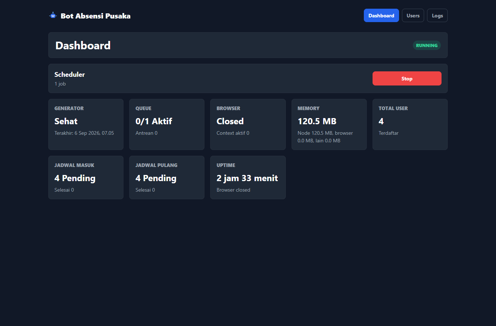
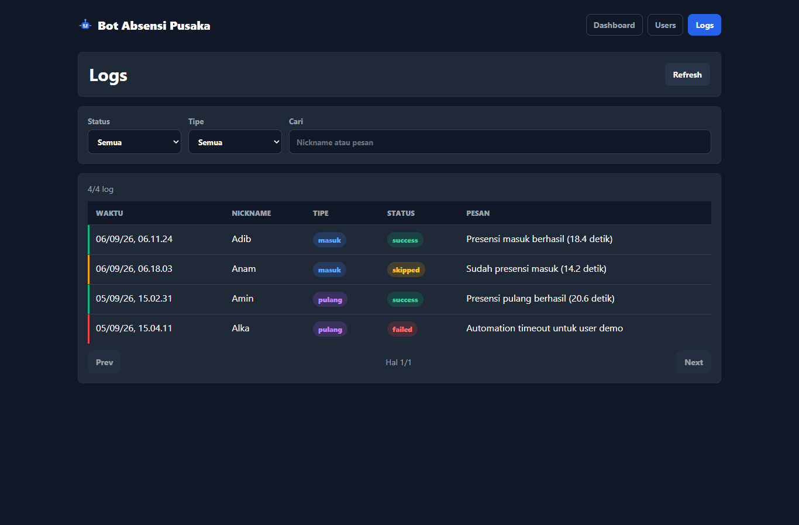

# Bot Absensi Pusaka

Bot Absensi Pusaka adalah aplikasi automation untuk membantu menjalankan proses presensi melalui browser terkontrol. Aplikasi ini membuat jadwal harian, menjalankan task secara antre, menyimpan hasil eksekusi, dan menyediakan dashboard internal untuk memantau status automation.

## Fitur

- Generator jadwal harian dengan waktu acak per pengguna.
- Executor berbasis antrean dengan batas concurrency.
- Dashboard status scheduler, browser, queue, memory, dan jadwal harian.
- Manajemen user dengan nickname.
- Log presensi dengan pagination dan filter.
- Deteksi hari libur nasional Indonesia melalui API eksternal.
- Penyimpanan lokal menggunakan SQLite.

## Tampilan

### Dashboard



### Logs



## Teknologi

- Node.js
- Express
- SQLite via `better-sqlite3`
- Puppeteer
- node-cron
- PM2 untuk deployment production

## Persiapan

```bash
npm install
cp .env.example .env
```

Isi `.env` sesuai environment lokal atau server. Jangan commit `.env`, database runtime, cookie browser, atau file credential.

## Menjalankan

```bash
npm start
```

Mode development:

```bash
npm run dev
```

Aplikasi berjalan pada port yang ditentukan oleh `PORT`, default `3000`.
