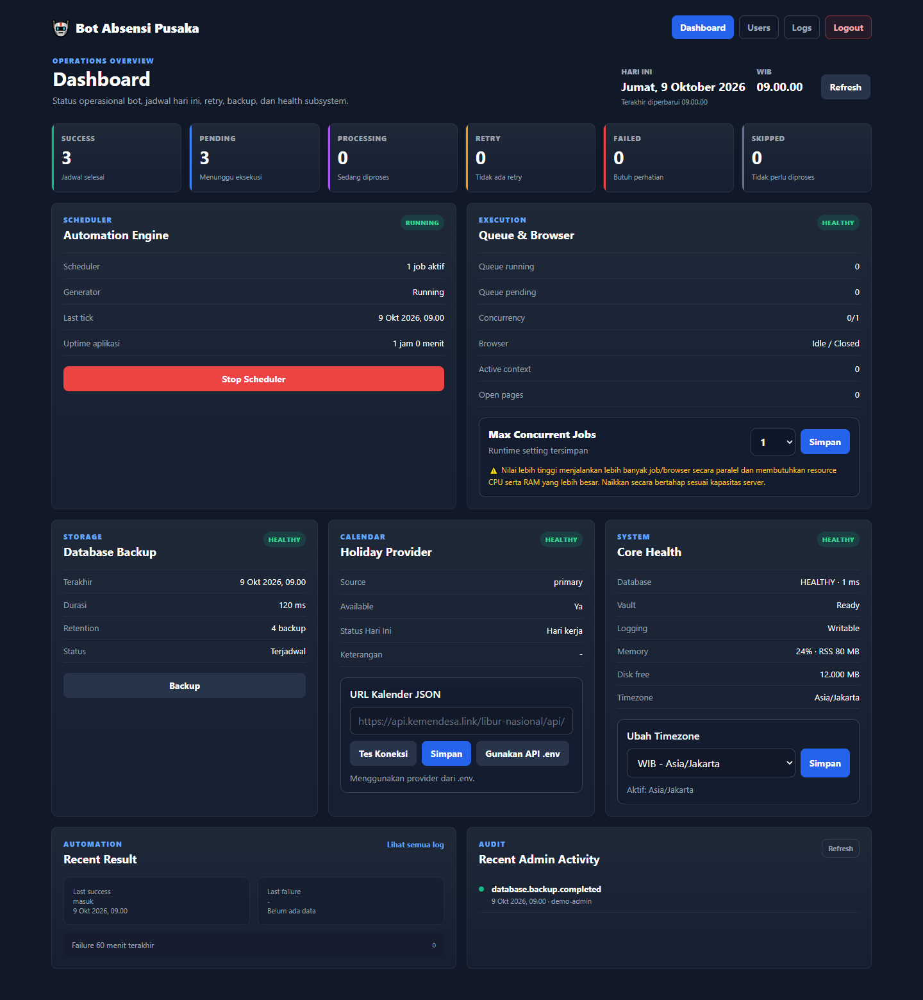
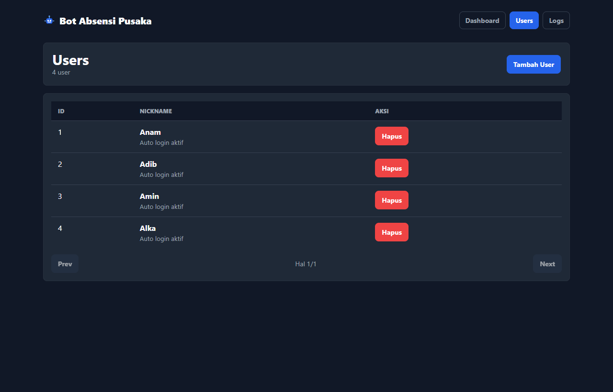
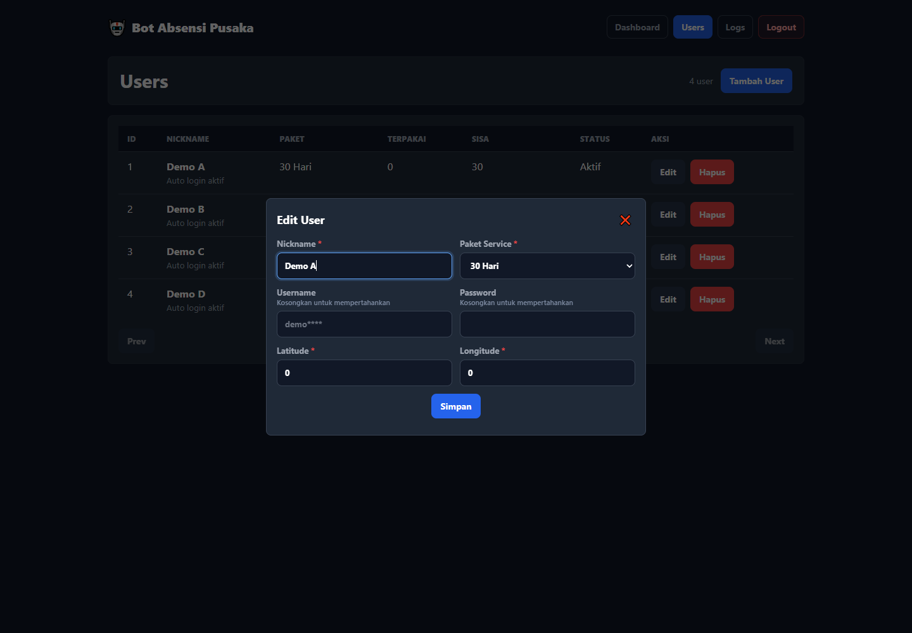
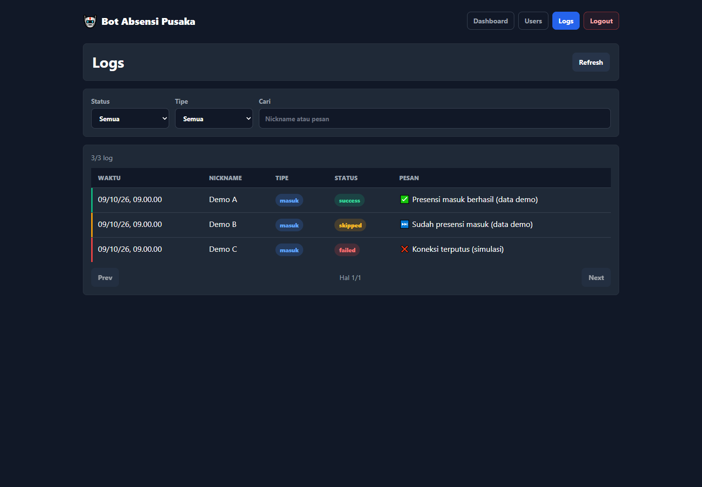

# Bot Absensi Pusaka

Bot Absensi Pusaka adalah aplikasi automation privat untuk mengelola jadwal dan menjalankan presensi melalui browser terkontrol. Dashboard internal menyediakan pemantauan antrean, hasil eksekusi, pengguna, dan kesehatan runtime.

## Fitur

- Jadwal acak per pengguna, pemulihan pemicu generator yang terlewat, dan retry dengan jitter.
- Antrean per pengguna dengan batas concurrency yang dapat diatur dari dashboard.
- Dashboard responsif untuk scheduler, browser, jadwal harian, audit, dan kesehatan sistem.
- Tambah, edit, dan hapus user dengan nickname serta credential terenkripsi. Password lama tidak dikirim ke frontend.
- Paket 1, 7, 30, 90 hari layanan atau tak terbatas. Masuk dan pulang pada hari yang sama dihitung satu hari; hari libur tidak mengurangi kuota.
- Kalender libur dengan provider fallback dan pengaturan URL kalender JSON yang didukung.
- Pengaturan timezone dengan tanggal dan jam sesuai wilayah operasional.
- Log dengan pagination, filter, normalisasi status, dan redaksi data sensitif.
- Backup SQLite mingguan dan manual, dengan default retention 4 file.
- Login admin, CSRF protection, pembatasan percobaan login, dan dukungan HTTPS melalui reverse proxy.
- Graceful shutdown yang menunggu antrean dan retry selesai sebelum menutup resource.

## Tampilan

Screenshot menggunakan data demo, bukan identitas atau hasil presensi produksi.

### Dashboard



### Users



### Edit User



### Logs



## Teknologi

- Node.js
- Express
- SQLite via `better-sqlite3`
- Puppeteer
- node-cron
- PM2 untuk deployment production

## Persiapan

```bash
npm ci
cp .env.example .env
npm run admin:hash
```

Pada PowerShell, gunakan `Copy-Item .env.example .env`. Jangan menimpa konfigurasi yang sudah digunakan.

Sesuaikan konfigurasi sebelum menjalankan:

| Konfigurasi | Fungsi |
| --- | --- |
| `BASE_URL_PUSAKA` | URL upstream Pusaka, bukan alamat dashboard |
| `APP_BASE_URL` | Origin aplikasi/dashboard |
| `APP_SECRET` | Secret sesi unik untuk instalasi |
| `ADMIN_USERNAME`, `ADMIN_PASSWORD_HASH` | Login admin; gunakan hash hasil CLI |
| `TZ` | Timezone operasional, default `Asia/Jakarta` |
| `AUTO_START` | Default `false`; aktifkan setelah konfigurasi diverifikasi |
| `MAX_CONCURRENT` | Batas awal antrean, 1 sampai 5 |

`.env.example` menggunakan baseline production HTTPS melalui reverse proxy loopback. Untuk development HTTP lokal, ikuti blok penyesuaian di akhir file tersebut; jangan hanya mengubah `NODE_ENV`.

Pertahankan credential key yang sama saat deploy atau restore agar credential tersimpan tetap dapat dibaca. Simpan `.env`, key, database, cookies, dan backup secara privat, di luar Git.

## Menjalankan

```bash
npm start
```

Mode development:

```bash
npm run dev
```

Aplikasi berjalan pada port yang ditentukan oleh `PORT`, default `3000`.

Perubahan timezone dari dashboard memerlukan restart aplikasi; jadwal dan log lama tidak dikonversi.

## Pengujian Lokal

Suite berikut menggunakan sandbox/data dummy tanpa menjalankan presensi nyata:

```bash
node scripts/regression/dashboard.mjs
node scripts/regression/user-service.mjs
node scripts/regression/calendar-settings.mjs
node scripts/regression/generator-recovery.mjs
```

Perbarui screenshot dari frontend aktual dengan API simulasi:

```bash
node scripts/documentation-screenshots.mjs
```
